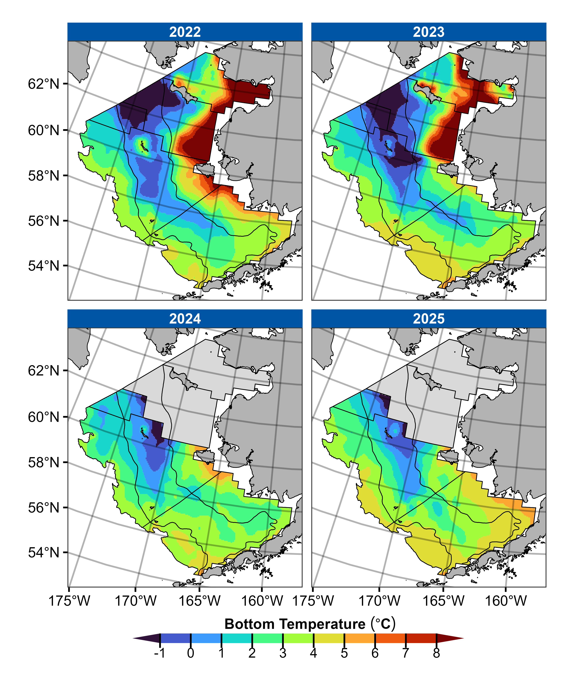

# Introduction

This repository contains an R package that is used to calculate the *cold pool index*, mean sea surface temperature, and mean bottom temperature using temperature data collected during bottom trawl surveys of the eastern Bering Sea conducted by NOAA/AFSC/RACE's Groundfish Assessment Program [(Rohan, Barnett, and Charriere, 2022)](https://doi.org/10.25923/1wwh-q418). The cold pool index is defined as the area of the NOAA/AFSC/RACE eastern Bering Sea bottom trawl survey footprint with bottom temperatures less than or equal to 2° Celsius, in square kilometers. This package includes temperature products (mean temperatures, cold pool area, interpolated temperature raster) that are updated on an annual basis following the eastern Bering Sea shelf bottom trawl survey.

- [Installation](https://github.com/afsc-gap-products/coldpool#installation)
- [Accessing datasets using the package](https://github.com/afsc-gap-products/coldpool#accessing-datasets-using-the-package)
- [Accessing datasets without installing the package](https://github.com/afsc-gap-products/coldpool#accessing-datasets-without-installing-the-package)
- [Datasets in the package](https://github.com/afsc-gap-products/coldpool#datasets-in-the-package)
- [Data collection and processing methods](https://github.com/afsc-gap-products/coldpool#data-collection)
- [Cold pool area and temperature trends](https://github.com/afsc-gap-products/coldpool#cold-pool-area-and-temperature-trends)
- [Citation](https://github.com/afsc-gap-products/coldpool#citation)


# Installation

1. Install the [akgfmaps package](https://github.com/sean-rohan-NOAA/akgfmaps) from GitHub prior to installing coldpool, as follows:
```{r}
devtools::install_github("sean-rohan-NOAA/akgfmaps", build_vignettes = TRUE)
```

If you encounter problems installing the akgfmaps package, please refer to the akgfmaps GitHub repository.

2. Install the coldpool package using the following code:
```{r}
devtools::install_github("afsc-gap-products/coldpool")
```

# Usage

## Accessing datasets using the package
Users can access temperature products directly from datasets that are built into the package. For example, after installing the package, users can access a data frame containing cold pool area (area with temperature less than or equal to 2°C), area of other isotherms (less than or equal to 1°C, 0°C, -1°C), mean bottom temperature, and mean surface temperature for the EBS, using:
```{r}
coldpool:::cold_pool_index
```

Documentation for the dataset can be accessed using:
```{r}
?coldpool:::cold_pool_index
```

## Accessing datasets without installing the package
Users can access temperature products in an R data format (.rda) without installing the package. To do so, download the [sysdata.rda](./R/sysdata.rda) file in the R directory of the coldpool repository. The data set can then be loaded in R after installing and loading the [terra](https://cran.r-project.org/web/packages/terra/index.html) package, as follows:

```{r}
# Load SpatRast package and data
library(terra)
load("[local_path]\\sysdata.rda")

# View loaded cold pool index data frame
cold_pool_index
```

## Datasets in the package

<dl>
<dt><b>cold_pool_index</b></dt>
<dd><p>Data frame containing the total area of EBS waters with bottom temperatures less than or equal to 2, 1, 0, and -1 °C, mean bottom temperature, and mean surface temperature during the EBS survey for 1982-2025 (excluding 2020 due to cancelled survey).</p></dd>
<dt><b>nbs_mean_bottom_temperature</b></dt>
<dd><p>Data frame containing the total area of EBS waters with bottom temperatures less than or equal to 2, 1, 0, and -1 °C, mean bottom temperature, and mean surface temperature in the NBS during years with a full EBS+NBS standardized survey (2010, 2017, 2019, 2021, 2022, 2023).</p></dd>
<dt><b>ebs_bottom_temperature</b></dt>
<dd><p>Interpolated rasters of bottom temperature for the EBS survey area from 1982-2025 (excluding 2020 due to cancelled survey).</p></dd>
<dt><b>ebs_surface_temperature</b></dt> 
<dd><p>Interpolated rasters of sea surface temperature for the EBS survey area from 1982-2025 (excluding 2020 due to cancelled survey).</p></dd>
<dt><b>ebs_bottom_salinity</b></dt>
<dd><p>Interpolated rasters of bottom salinity (PSS-78) for the EBS survey area for 2010, 2017, and 2021-2024</p></dd>
<dt><b>nbs_ebs_bottom_temperature</b></dt> 
<dd><p>Interpolated rasters of bottom temperature for the full EBS and NBS survey area for years with a full EBS+NBS standardized survey (2010, 2017, 2019, 2021, 2022, 2023).</p></dd>
<dt><b>nbs_ebs_surface_temperature</b></dt> 
<dd><p>Interpolated rasters of sea surface temperature for the full EBS and NBS survey area for years with a full EBS+NBS standardized survey (2010, 2017, 2019, 2021, 2022, 2023).</p></dd>
<dt><b>nbs_ebs_bottom_salinity</b></dt> 
<dd><p>Interpolated rasters of bottom salinity (PSS-78) for the full EBS and NBS survey area for 2010, 2017, and 2021-2024</p></dd>
</dl>

## Caveat emptor

The temperature data products in this package are an annual snapshot of temperatures during summer bottom trawl surveys. Combined with biological data collected during bottom trawl surveys, these temperature data can provide a simultaneous characterization of thermal habitat and demersal fauna distribution and abundance in the eastern Bering Sea. However, these temperature data products are not adjusted to account for seasonal heating so they do not provide a snapshot of temperature at a specific point in time. Users who are interested in spatially integrated or spatially resolved estimates of temperature at specific points in time that do account for seasonal heating may want to consider using temperature predictions from the [Bering10K BEST-NPZ model](https://github.com/beringnpz/roms-bering-sea) [(Kearney et al., 2020)](http://www.doi.org/10.5194/gmd-13-597-2020), [satellite-derived sea surface temperature](https://github.com/jordanwatson/aksst) products, or alternative oceanographic sampling data, such as those collected by NOAA's [EcoFOCI](https://www.ecofoci.noaa.gov/) program.

# Methods

## Data collection

Temperature data have been collected annually during AFSC's standardized summer bottom trawl surveys of the eastern Bering Sea continental shelf (EBS shelf) and northern Bering Sea (BS). The EBS shelf survey has been conducted annually since 1982 (except for 2020) and the NBS survey was conducted in 2010, 2017, 2019, 2021-2023, and 2025. In the eastern Bering Sea, surveys are conducted from late May or early June through late July to early August and the northern Bering Sea survey is conducted immediately after the EBS shelf survey (July-August). The EBS shelf survey samples 350 index stations and the NBS survey samples 142 index stations per year, although the survey footprint and number of stations has changed over time (e.g. EBS NW strata added in 1987). The EBS shelf survey progresses from the nearshore waters inside Bristol Bay to the outer continental shelf in the NW portion of southeastern Bering Sea (Figure 1). The NBS survey starts offshore where the EBS shelf survey ends, then progresses northward towards the Bering Strait and Norton Sound, before heading south towards Nunivak Island.


 <font size="2"><i>Figure 1. Map of eastern Bering Sea (EBS) shelf and northern Bering Sea (NBS) shelf survey areas and station grid, including EBS standard (sampled since 1982) and northwest (sampled since 1987) subareas. Thick black lines denote survey boundaries and fill color denotes the average day of year when stations are sampled by the survey.</i></font>

Temperature data are collected at every survey station using temperature sensors attached to the bottom trawl survey gear. The equipment used to collect temperature data has changed over time, as described in [Buckley et al. (2009)](https://repository.library.noaa.gov/view/noaa/3655).

## Interpolation and analysis

Raster surfaces and temperature products are produced by interpolating temperature data collected during surveys using ordinary kriging with Stein’s parameterization of the Matérn semivariogram. Only data from hauls with 'good' performance are included in temperature calculations. Statistics that summarize temperature patterns are produced from raster surfaces: areas of isotherms in the EBS shelf survey area (2°C, 1°C, 0°C, -1°C), mean bottom temperature over the EBS shelf and NBS (i.e., gear temperature), and sea surface temperature over the EBS shelf and NBS. For the EBS shelf survey area, temperature data used to calculate summary statistics do not include NBS data because of a warm bias in NBS survey years that is caused by the southern portion of the nearshore domain of the NBS being sampled last. The interpolation region for the EBS shelf includes both the standard area (sampled from 1982-present) and the NW strata (sampled from 1987-present) for all years (Figure 1). The NBS interpolation only includes data from years with a full NBS survey and uses data from the EBS Standard, EBS NW, and NBS survey areas.

## Data product and package updates

Temperature data products in the coldpool package are updated annually in August-September following the conclusion of summer bottom trawl surveys.


# Cold pool area and temperature trends
*Updated: August 1, 2025*

Cold pool area and temperature trends are reported in the annual [Ecosystem Status Reports](https://www.fisheries.noaa.gov/alaska/ecosystems/ecosystem-status-reports-gulf-alaska-bering-sea-and-aleutian-islands) for the eastern Bering Sea and ecosystem and socioeconomic profiles for EBS stocks. Temperature products are also used as covariates in some [stock assessment](https://www.fisheries.noaa.gov/alaska/population-assessments/north-pacific-groundfish-stock-assessments-and-fishery-evaluation) models or their inputs (e.g. abundance indices).


 <font size="2"><i>Figure 2. Cold pool extent in the eastern Bering Sea from 2005–2025, showing areas with bottom temperatures ≤ 2°C, ≤ 1°C, ≤ 0°C, and ≤ -1°C (upper panels), and proportion of the southeastern Bering Sea survey area with bottom temperatures ≤ 2°C, ≤ 1°C, ≤ 0°C, and ≤ -1°C (lower panel). Solid black lines in the interior of the surface represent the 50m and 100m isobaths.</i></font>


 <font size="2"><i>Figure 3. Contour map of bottom temperatures from the past four eastern and northern Bering Sea shelf bottom trawl surveys (2022-2025). Solid black contour lines denote stratum boundaries.</i></font>


 <font size="2"><i>Figure 4. Average summer surface (green triangles) and bottom (blue circles) temperatures (°C) of the eastern Bering Sea (EBS) shelf and northern Bering Sea (NBS) shelf based on data collected during standardized summer bottom trawl surveys from 1982–2024. Dashed lines represent the time series mean for the EBS (1982–2025, except 2020) and NBS (2010, 2017, 2019, 2021-2023).</i></font>

# Citation

Rohan, S.K., Barnett L.A.K., and Charriere, N. 2022. Evaluating approaches to estimating mean temperatures and cold pool area from AFSC bottom trawl surveys of the eastern Bering Sea. U.S. Dep. Commer., NOAA Tech. Mem. NMFS-AFSC-456, 42 p. [https://doi.org/10.25923/1wwh-q418](https://doi.org/10.25923/1wwh-q418)

# NOAA README
This repository is a scientific product and is not official communication of the National Oceanic and Atmospheric Administration, or the United States Department of Commerce. All NOAA GitHub project code is provided on an ‘as is’ basis and the user assumes responsibility for its use. Any claims against the Department of Commerce or Department of Commerce bureaus stemming from the use of this GitHub project will be governed by all applicable Federal law. Any reference to specific commercial products, processes, or services by service mark, trademark, manufacturer, or otherwise, does not constitute or imply their endorsement, recommendation or favoring by the Department of Commerce. The Department of Commerce seal and logo, or the seal and logo of a DOC bureau, shall not be used in any manner to imply endorsement of any commercial product or activity by DOC or the United States Government.

# NOAA License
Software code created by U.S. Government employees is not subject to copyright in the United States (17 U.S.C. §105). The United States/Department of Commerce reserve all rights to seek and obtain copyright protection in countries other than the United States for Software authored in its entirety by the Department of Commerce. To this end, the Department of Commerce hereby grants to Recipient a royalty-free, nonexclusive license to use, copy, and create derivative works of the Software outside of the United States.
<br>

<br>
[U.S. Department of Commerce](https://www.commerce.gov/) \| [National Oceanographic and Atmospheric Administration](https://www.noaa.gov) \| [NOAA Fisheries](https://www.fisheries.noaa.gov/)
